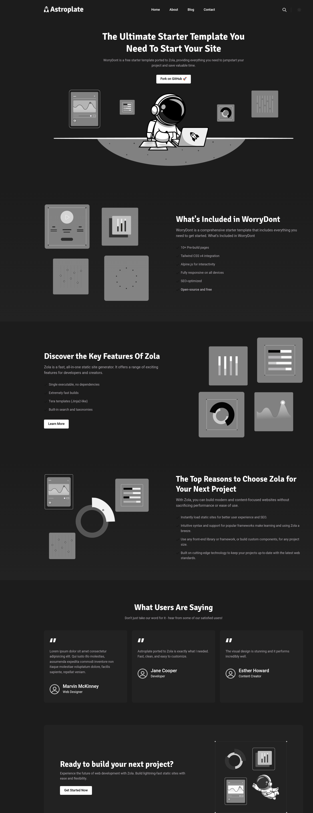

# zola-astroplate

A port of [Astroplate](https://github.com/zeon-studio/astroplate) to [Zola](https://www.getzola.org/),
built on the Zolarwind architecture. Tailwind v4, i18n, client-side search, dark/light mode, taxonomies.

- **License:** MIT
- **Min Zola version:** 0.19.0
- **Homepage:** https://github.com/worrydont/zola-astroplate



## Install

As a git submodule (recommended — easy updates):

```bash
git submodule add https://github.com/worrydont/zola-astroplate themes/zola-astroplate
```

Or a plain clone into your site's `themes/` directory:

```bash
git clone https://github.com/worrydont/zola-astroplate themes/zola-astroplate
```

## Use

In your site's `config.toml` (or `zola.toml`), set the theme at the **top level** of the file:

```toml
theme = "zola-astroplate"
```

This theme loads its i18n strings via an `[extra]` variable — point it at the theme's `i18n/` dir:

```toml
[extra]
path_language_resources = "themes/zola-astroplate/i18n/"
```

### Required / reference configuration

Copy this as a starting point and adjust:

```toml
compile_sass = false
build_search_index = true
generate_feeds = true

taxonomies = [
    { name = "tags", paginate_by = 6, feed = true },
    { name = "categories", paginate_by = 6, feed = true },
]

[extra]
title = "Your Site"
site_description = "Your description"
copyright = "Copyright {year} by You"
author = { name = "You", homepage = "https://example.com" }
path_language_resources = "themes/zola-astroplate/i18n/"
favicon_svg = "/img/favicon.svg"
logo = "/images/logo.png"
logo_darkmode = "/images/logo-darkmode.png"

menu_pages = [
    { title = "Home", url = "/" },
    { title = "Blog", url = "/blog/" },
]
footer_pages = [
    { title = "Privacy Policy", url = "/pages/privacy/" },
]
social_links = [
    # { name = "github", enabled = true, link = "...", svg = '...' },
]

# Optional: override brand colors (see "White-label Theming" below)
[extra.theme]
# primary = "#FF5733"

# Optional: hide homepage sections (default: all enabled)
[extra.sections]
# banner = false
```

Dark/light toggle icons are supplied via `[extra.displaymode.sun]` / `[extra.displaymode.moon]`
(inline SVG). See this theme's source/demo site for a complete working `[extra]` block.

## White-label Theming

The theme is fully rebrandable via `zola.toml` without touching any template or CSS files.

### How the cascade works

Token defaults live in one place: the Tailwind `@theme` block in the committed
`static/css/generated.css`. The `theme-vars.html` partial emits a `<style>` block in `<head>`
**after** the stylesheet `<link>`, so equal-specificity overrides win by source order — no
`!important` needed. Only tokens you explicitly set in `[extra.theme]` are emitted; unset tokens
fall through to the Tailwind defaults untouched.

During a dev session the customizer adds a third layer of inline styles on `document.documentElement`
(see [Live Customizer](#live-customizer-dev-only) below). Precedence: Tailwind defaults →
`[extra.theme]` overrides → customizer draft.

### Token reference

All tokens are defined in `data/tokens.toml`. Set any subset in `[extra.theme]`:

#### Light mode

| Key | CSS custom property | Description |
|-----|-------------------|-------------|
| `primary` | `--color-primary` | Brand/accent color |
| `body` | `--color-body` | Page background |
| `border` | `--color-border` | Border color |
| `light` | `--color-light` | Light surface |
| `dark` | `--color-dark` | Dark surface |
| `text` | `--color-text` | Body text |
| `text_dark` | `--color-text-dark` | Headings / emphasis |
| `text_light` | `--color-text-light` | Muted / secondary text |

#### Dark mode

| Key | CSS custom property | Description |
|-----|-------------------|-------------|
| `darkmode_primary` | `--color-darkmode-primary` | Brand/accent (dark) |
| `darkmode_body` | `--color-darkmode-body` | Page background (dark) |
| `darkmode_border` | `--color-darkmode-border` | Border (dark) |
| `darkmode_light` | `--color-darkmode-light` | Light surface (dark) |
| `darkmode_dark` | `--color-darkmode-dark` | Dark surface (dark) |
| `darkmode_text` | `--color-darkmode-text` | Body text (dark) |
| `darkmode_text_dark` | `--color-darkmode-text-dark` | Headings / emphasis (dark) |
| `darkmode_text_light` | `--color-darkmode-text-light` | Muted / secondary text (dark) |

#### Fonts

| Key | CSS custom property | Description |
|-----|-------------------|-------------|
| `font_primary` | `--font-primary` | Primary (body) font family |
| `font_secondary` | `--font-secondary` | Secondary (heading) font family |

Font links (Google Fonts or other CDN) can also be injected via `font_primary_link` /
`font_secondary_link` in `[extra.theme]`; the partial emits the `<link rel="preconnect">` and
`<link rel="stylesheet">` tags automatically.

**Example:**

```toml
[extra.theme]
primary        = "#6366f1"
body           = "#ffffff"
text           = "#374151"
text_dark      = "#111827"
text_light     = "#6b7280"
darkmode_body  = "#0f172a"
font_primary   = "'Inter', sans-serif"
font_primary_link = "https://fonts.googleapis.com/css2?family=Inter:wght@400;500;700&display=swap"
```

### Section toggles

Control which homepage sections render via `[extra.sections]`. All sections are **enabled by
default** — add the block only when you want to disable something:

```toml
[extra.sections]
banner       = true   # default
features     = true   # default
testimonials = false  # omit from output
cta          = true   # default
```

In a production build (`mise run build`) a disabled section is **completely absent** from the
generated HTML — no wrapper, no content. Existing sites with no `[extra.sections]` block continue
to render all sections unchanged.

## Live Customizer (dev only)

The theme ships a floating customizer panel for rapid brand prototyping directly in the browser.

**It is automatically gated to development.** No config flag needed. The customizer appears when
you run `mise run serve` (which starts a pitchfork background daemon with `ZOLA_ENV=dev`) and is
completely absent from `mise run build` output — it cannot accidentally ship to production.

### Workflow

1. `mise run serve` — starts the Zola dev server in the background via pitchfork; ready at `http://127.0.0.1:1111`. Use `mise run stop` to stop it.
2. Click the floating button in the bottom-right corner to open the panel.
3. Switch tabs to adjust **Light mode**, **Dark mode**, **Fonts**, or **Sections**. Changes apply
   live and **persist across page refreshes** within the same browser tab (stored in
   `sessionStorage`).
4. Click **Export TOML** to copy a ready-to-paste config snippet.
5. Paste the snippet into your `[extra.theme]` and `[extra.sections]` blocks in `zola.toml` to
   commit the changes.
6. Click **Reset** to clear the working draft and revert to whatever `zola.toml` currently
   configures (or Tailwind defaults if nothing is set).

### Session persistence

The customizer draft (colors, fonts, section toggles) is stored in `sessionStorage` for the
current tab. On reload the customizer re-applies the draft immediately — you can freely reload
the page while tweaking without losing your place. The draft is discarded when the tab is closed or
after you click Reset.

## New-Site Scaffolding Checklist

To spin up a new site from scratch using `zola-astroplate`:

1. **Create and enter a new directory**:
   ```bash
   mkdir my-new-site && cd my-new-site
   ```

2. **Initialize Git repository**:
   ```bash
   git init
   ```

3. **Add the theme as a submodule**:
   ```bash
   git submodule add https://github.com/worrydont/zola-astroplate themes/zola-astroplate
   ```

4. **Create the initial site structure**:
   ```bash
   mkdir -p content templates static i18n
   ```

5. **Copy recommended initial configuration**:
   Create a `zola.toml` in your site's root directory and paste the **Required / reference
   configuration** block shown above.

6. **Initialize the homepage content**:
   Create `content/_index.md` with homepage sections:
   ```markdown
   +++
   title = "Home"
   template = "index.html"

   [extra.banner]
   enable = true
   title = "Welcome to My New Site"
   content = "Built with Zola and zola-astroplate theme."
   +++
   ```

7. **Run the site locally**:
   ```bash
   zola serve
   ```
   Open `http://127.0.0.1:1111` in your browser.

## Customizing

Override any theme file by creating a file with the same path in your site's `templates/` or
`static/` directory. Override config values in your `[extra]` section. See the
[Zola theme docs](https://www.getzola.org/documentation/themes/installing-and-using-themes/).

To add a new brand token: add one row to `data/tokens.toml` in the theme submodule. The override
partial, the customizer UI, and the TOML exporter all iterate the registry — no other files need
changing.

## Development

This repo ships [mise](https://mise.jdx.dev/) tasks; with mise installed the required tools
(Zola, Node) are provisioned automatically. The compiled `static/css/generated.css` is
**committed**, so consumers never need to run Tailwind.

```bash
mise run setup       # install Tailwind v4 build deps (npm install)
mise run css:build   # one-off minified build -> static/css/generated.css
mise run css:watch   # rebuild on every change
```

After changing Tailwind classes or `css/main.css`, rebuild `generated.css` and commit it.

Plain npm equivalents (`npm install`, `npm run css:build`, `npm run css:watch`) also work.

### Live preview with pitchfork

A theme is previewed through a site that uses it. Run the Tailwind watcher in the background with
[pitchfork](https://github.com/jdx/pitchfork) (config in `pitchfork.toml`) while the parent site's
`zola serve` live-reloads as the CSS rebuilds:

```bash
mise run dev    # pitchfork start css  — background Tailwind watcher
mise run logs   # tail the watcher
mise run stop   # stop the watcher
```

## Screenshot

`screenshot.png` (shown above) is committed for the theme gallery. To refresh it, capture the
running demo site at `http://127.0.0.1:1111`.
